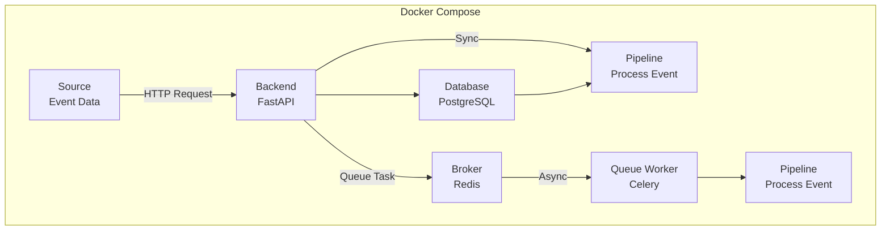
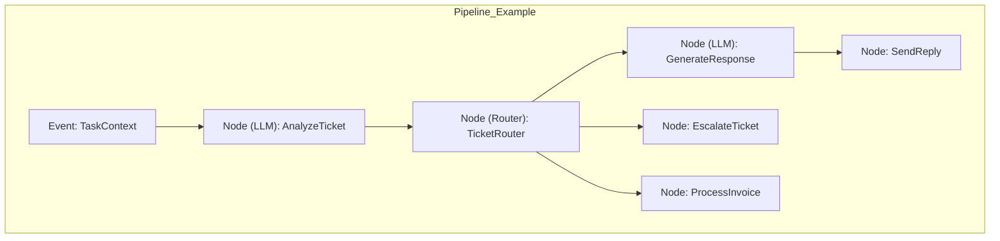

# Specification Template
> Ingest the information from this file, implement the Low-Level Tasks, and generate the code that will satisfy the High and Mid-Level Objectives.

## High-Level Objective

1) ChatAgent:
  - Recieves user input, passes query to the IntentIdentifier.
  - On reciept of identified intents, it formats a prosaic summary of processing and returns this to the user.
  - On initiation of the chat sequence, the ChatAgent is responsible for determining whether the user is new and if they want to continue working on  apre-existing formulation or begin a new one. A postgres database table of Clients (session_id: str, client_id: int) is used to dertermine this.
2) IntentIdentifierAgent: Identify the user's intent. Initially this will be one or more of thess three intents (a user prompt may contain multiple intents): 
  - "make_notes"
  - "ask_question"
  - "switch_formulation"
3) EventAgent: Recieves array of user intents and translates this into tasks passed to Celery for asynchronous execution. There is one event type for each intent. After the KnowledgeAgent completes tasks, the EventAgent will be responsible for sending the results to the ChatAgent.
4) KnowledgeAgent: Responsible CRUD operations on the formulation graph, persisting and retrieving the formulation graph from the database.

An event pipeline is used to manage the flow of the application.



Pipeline example:



## Mid-Level Objective

- [List of mid-level objectives - what are the steps to achieve the high-level objective?]
- [Each objective should be concrete and measurable]
- [But not too detailed - save details for implementation notes]

## Implementation Notes
- [Important technical details - what are the important technical details?]
- [Dependencies and requirements - what are the dependencies and requirements?]
- [Coding standards to follow - what are the coding standards to follow?]
- [Other technical guidance - what are other technical guidance?]

## Context

### Beginning context
- [List of files that exist at start - what files exist at start?]

### Ending context  
- [List of files that will exist at end - what files will exist at end?]

## Low-Level Tasks
> Ordered from start to finish

1. [First task - what is the first task?]
```aider
What prompt would you run to complete this task?
What file do you want to CREATE or UPDATE?
What function do you want to CREATE or UPDATE?
What are details you want to add to drive the code changes?
```
2. [Second task - what is the second task?]
```aider
What prompt would you run to complete this task?
What file do you want to CREATE or UPDATE?
What function do you want to CREATE or UPDATE?
What are details you want to add to drive the code changes?
```
3. [Third task - what is the third task?]
```aider
What prompt would you run to complete this task?
What file do you want to CREATE or UPDATE?
What function do you want to CREATE or UPDATE?
What are details you want to add to drive the code changes?
```
